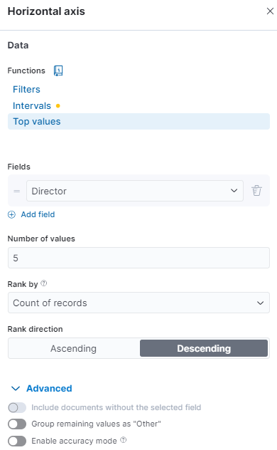
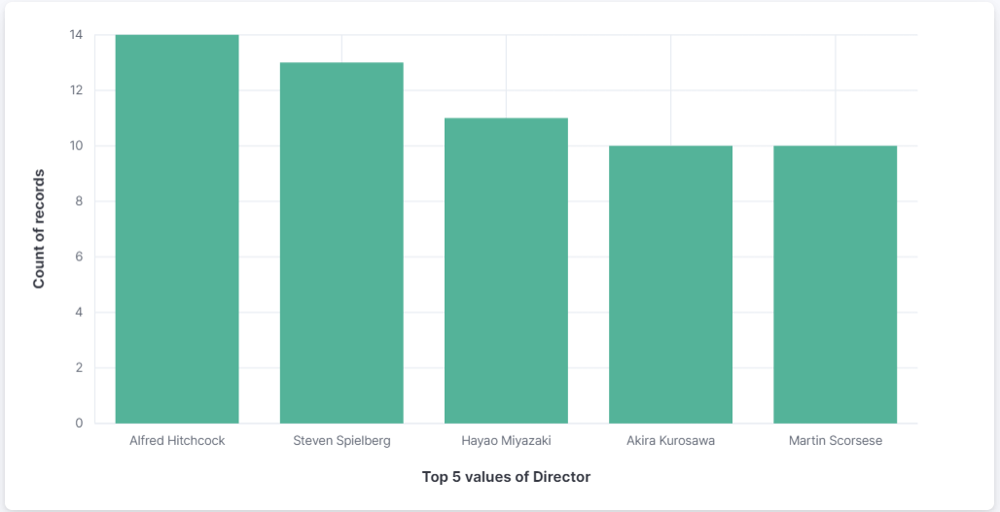
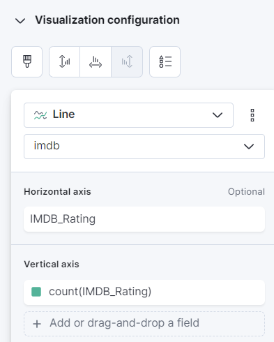
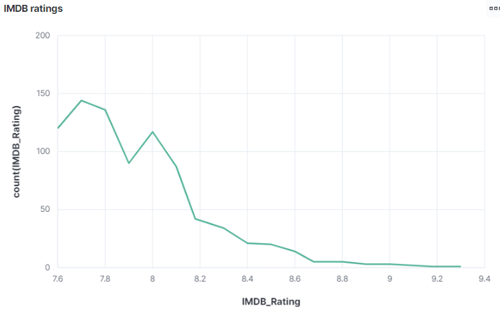
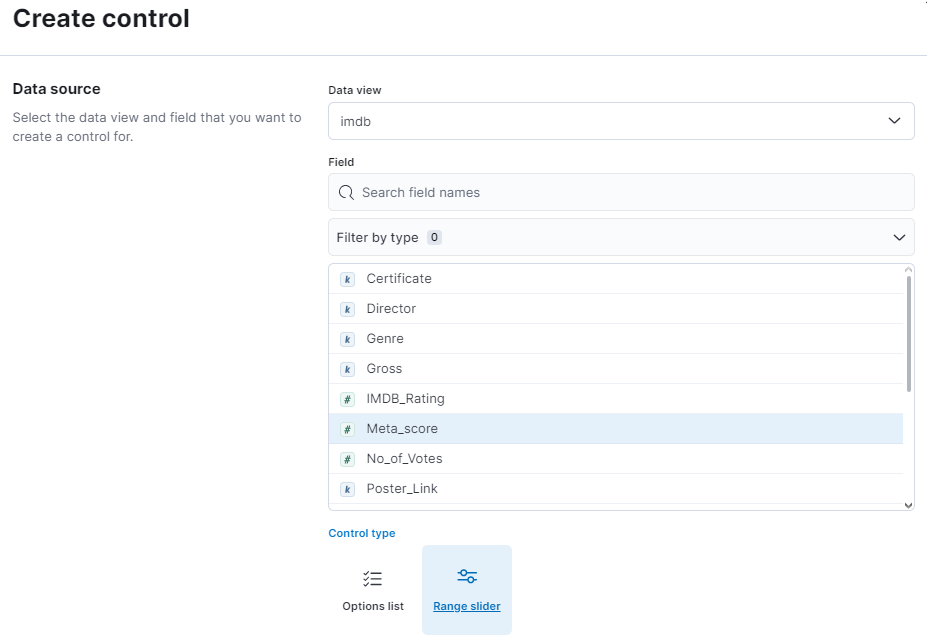

# Kibana Assignment

## Adding data source

Data source:
- IMDB top movies

## Discover data


After clicking on 'Kibana Discover' on the left menu, change to the IMDB data view. <br>
Now all 1000 documents should be listed below in the main view, as well as the data fields on the left side.

### 1.1 Filtering IMDB Ratings
in the field at the top "Filter your data using KQL syntax" insert the following code to only show movies with an IMDB rating of 8 and above:
```
IMDB_Rating >= 8
```
This results in 463 documents that match the criteria.

### 1.2 Filtering Genres

Alter the filter to the following to include any movie that includes the drama genre definition:
```
IMDB_Rating >= 8 and Genre : *Drama*
```
This results in 350 documents that match the criteria.

### 1.3 Bonus Question
Why is the correct answer not a recommended search practice in most cases? <br>

The correct answer includes a leading wildcard (asterix before 'Drama'), meaning every genre field needs to be searched completely in case 'Drama' appears before going to the next document. With large field values and big data this can create searches that take a long time. <br>
In some use cases it can make sense to disable the use of leading wildcards.


## 2. Create a dashboard
Click 'Create visualization' in the top left corner. You are now using the Lens editor with which you can drag and drop field names into the workspace. Lens then creates a starting visualization with the field name provided.

### 2.1 Visualize Top Directors
Create a visualization that shows only the top 5 directors and how many movies they directed that are part of the list.<br>
To start, drag the field 'Director' into the workspace.
I chose a bar chart visualization at the top.

On the horizontal axis specify
```
Top 5 values of Director
```
as follows:<br>



The advanced feature 'Group remaining values as "Other"' has to be deactivated to only view the top 5 directors.

The vertical axis is:
```
Count of records
```
This results in the following visualization:


### 2.2 Visualize IMDB Ratings
Create a visualization that shows how often an IMDB rating was given in a range of ca. 0.2 steps.

To add another visualization to your dashboard, you must first save your first visualization and return to the dashboard view by pressing the 'Save and return button' in the top right corner.<br>

To create the IMDB rating overview, drag and drop the field 'IMDB_rating' into the workspace. Then, chose a line representation, 'IMDB_rating' as horizontal axis and 'count(IMDB_rating)' as vertical axis to display every default ~0.2 interval of ratings and its appearance in all movie ratings. 


The result should look like this:




### 2.3 Filtering data in Dashboard
Create a control that filters the movies based on their meta score using a range slider. Try out how the adjustment of the score affects the visualizations!

Click the 'Controls' button, click 'Add control', select 'Meta_score' as field and 'Range Slider' as control type. Save and close.

