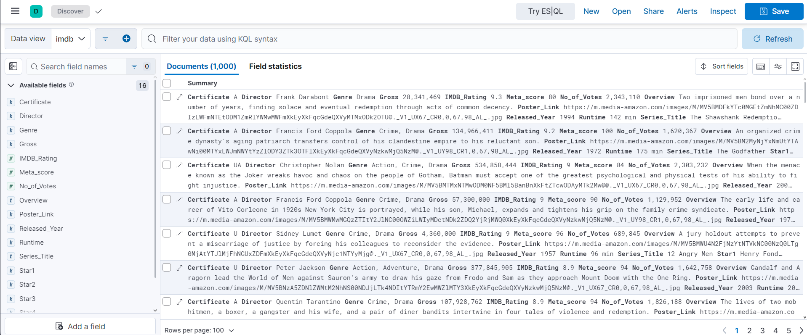

# Kibana Assignment

## Adding data source

Data source:
- IMDB top movies

## Discover data


After clicking on 'Kibana Discover' on the left menu, change to the IMDB data view. <br>
Now all 1000 documents should be listed below in the main view, as well as the data fields on the left side.

### 1.1 Filtering IMDB Ratings
in the field at the top "Filter your data using KQL syntax" insert the following code to only show movies with an IMDB rating of 8 and above:
```
IMDB_Rating >= 8
```
This results in 463 documents that match the criteria.

### 1.2 Filtering Genres

Alter the filter to the following to include any movie that includes the drama genre definition:
```
IMDB_Rating >= 8 and Genre : *Drama*
```
This results in 350 documents that match the criteria.

### 1.3 Bonus Question
Why is the correct answer not a recommended search practice in most cases? <br>

The correct answer includes a leading wildcard (asterix before 'Drama'), meaning every genre field needs to be searched completely in case 'Drama' appears before going to the next document. With large field values and big data this can create searches that take a long time. <br>
In some use cases it can make sense to disable the use of leading wildcards.


## 2. Create a dashboard
### 2.1 Visualize Top Directors
Create a visualization that shows only the top 5 directors and how many movies they directed that are part of the list.
### 2.2 Visualize IMDB Ratings
Create a visualization that shows how often an IMDB rating was given in a range of ca. 0.2 steps.
### Filtering data in Dashboard
Filter the visualizations to only consider movies with an IMBD rating of over 8.5.