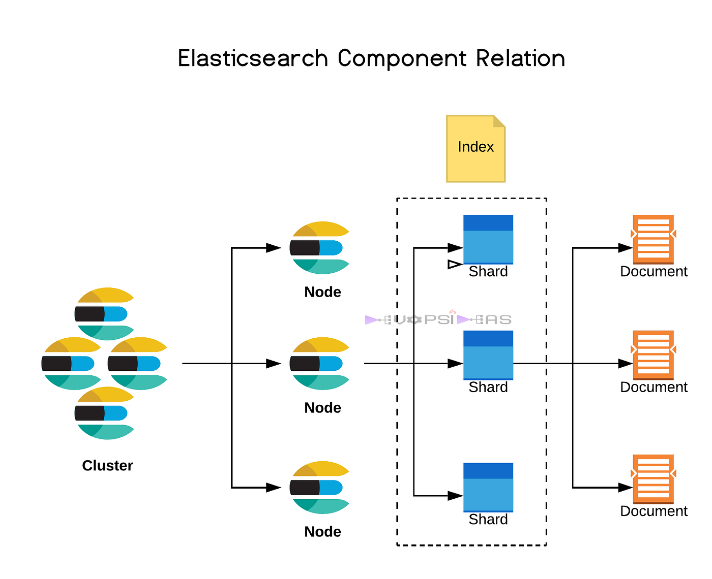

# Introduction

## What is it + Elastic Stack
Elasticsearch is an open-source search and analytics engine that allows for quick, scalable, and efficient searching, analyzing, and storing of large volumes of data without noticeable performance impact.

It's built on Apache Lucene (search engine library written in Java!) and provides a distributed, multitenant-capable (mode of operation of software where multiple independent instances of one or multiple applications operate in a shared environment) full-text search engine with an HTTP RESTful interface and schema-free JSON documents.
https://www.elastic.co/guide/en/elasticsearch/reference/current/elasticsearch-intro-what-is-es.html
https://sue.nl/wp-content/uploads/sites/8/2022/07/elastic-logo-920x920-sue-v02.png


## History
First released in 2010. Gained popularity due to ability to scale (horizontal scaling via adding nodes to cluster) and handle large amounts of data.

Rebranded to Elastic Stack in 2015, with additional tools - Kibana, Logstash and Beats.
https://www.michael-wutzke.com/wp-content/uploads/2019/02/how-it-works-elastic-stack-beats-logstash-elasticsearch-kibana.png

## Visual use cases examples
https://www.elastic.co/demo-gallery/ent-search

## Use cases
Elasticsearch is widely used for log and event data analysis, real-time application monitoring, and search functionalities across various types of documents.
Elasticsearch is used for a wide and growing range of use cases. Here are a few examples:

- Application search
- Web search
- Enterprise search
- Logging and log/data analytics
    - Infrastructure metrics
    - Container monitoring
    - Geospartial data analysis and visualization (ex. Flights from - to)
...


## Content Search Engine
Elasticsearch doesn't use concepts as primary keys or relations, since it is a schema-free/less NoSQL JSON data storage. You might have noticed, I haven't used word dat abase anywhere. It also isn't ACID complaint, especially with multi-document transactions.

Full-text search: Build a fast, relevant full-text search solution using inverted indexes, tokenization, and text analysis. (We're gonna explain those, don't worry!)
Vector storage: Store and search vectorized data, and create vector embeddings with built-in and third-party natural language processing (NLP) models.
Semantic search: Understand the intent and contextual meaning behind search queries using tools like synonyms, dense vector embeddings, and learned sparse query-document expansion.
Hybrid search: Combine full-text search with vector search using modern ranking algorithms.
Build search experiences: Add hybrid search capabilities to apps or websites, or build enterprise search engines over your organization’s internal data sources.


## Use examples
Volkswagen - uses Elasticsearch for long storage and Kibana for visualization.
https://www.elastic.co/elasticon/tour/2017/munich/distributed-logging-and-monitoring-at-volkswagen-using-the-elastic-stack

Airbus - Near Real-Time access to aircraft technical documents (2 billion blocks of technical documents, 3 000 queries per minute). Results under 2 seconds.
https://www.elastic.co/customers/airbus

Microsoft - Azure environment monitoring with Elasticsearch for longs and Kibana for visualizations.
https://www.elastic.co/elasticon/conf/2018/sf/monitor-your-cloud-environment-with-the-logstash-azure-monitoring-module

GitHub - search feature. 2 billion documents. Analytics to reveal rogue users and software bugs by indexing all alerts, events, logs and tracking rate of specific code exceptions.
https://www.elastic.co/customers/github

## How does it work?

Data can get inserted into Elasticsearch directly, or throught pipelines such as Logstash, which can manipulate the data to correct format for example, before is it processed by Elasticsearch.


When data is inserted, it is parsed, normalized and tokenized before being saved into a Index. 

Tokenization - input is split into individual terms/tokens. By default divides text on word boundaries and removes most punctuation symbols.
"Hello ESD workshop!" -> "Hello", "ESD", "workshop"

Normalization - input is converted to standard form. Lowercasing, removing punctuation, etc...
"Hello", "ESD", "workshop" -> "hello", "esd", "workshop"

Tokens from tokenization get saved into "inverted-index" (the magic thing making Elasticsearch so fast).


---

# Alternatives
https://coralogix.com/guides/elasticsearch/elasticsearch-vs-opensearch-key-differences/
https://bigdataboutique.com/blog/opensearch-vs-elasticsearch-an-up-to-date-comparison-5c1c71
https://typesense.org/
https://www.meilisearch.com/
https://manticoresearch.com/


## Licensing drama

The only "fully fledged" alternative is OpenSearch (created by Amazon), which is a fork of 2021 version of Elasticsearch. In 2021 Elastic NV announced it would be changing the license of Elasticsearch and Elastic Stack to "Server Side Public License (SSPL)". MongoDB introduced similiar license and it includes restrictions on the use of the software by cloud providers. (Basically SaaS) This is because Elastic NV offers cloud deployment of the Elastic Stack as their main source of revenue and Amazon heavily advertised/pushed for their ElasticSearch AWS deployment. ElasticSearch theoretically still remained open-source, but a part of community believed this license change to be against principles of open-source and with the push from Amazon forked ElasticSearch under the Apache 2.0 License.

In September 2024, Elastic NV stated its goals have been met and added AGPLv3 open source license as one of the options.

https://medium.com/@TechTim42/elastic-search-and-open-search-a-brief-history-of-the-license-war-8f474743e2ff
https://en.wikipedia.org/wiki/OpenSearch_(software)

## Comparisons (to SQL)

| Elasticsearch | RDBMS      |
|---------------|------------|
| Cluster       | Database   |
| Index         | Table      |
| Document      | Column/row |

---
## Available clients (Java, C#...)
Elasticsearch provides REST endpoints as the only form of interaction. Of course noone wants to manually put together HTTP request bodies, so Elastic provides client libraries for a few platforms: Java, JavaScript, Ruby, Go, .NET (C#), PHP, Perl, Python, Eland and Rust.
With these libraries, users can build/send requests and receive responses in language native syntax.

```java
String searchText = "bike";

SearchResponse<Product> response = esClient.search(s -> s
    .index("products") 
    .query(q -> q      
        .match(t -> t   
            .field("name")  
            .query(searchText)
        )
    ),
    Product.class      
);

```

# Core concepts
## Documents
Elasticsearch document is a JSON object that contains the data for a single item in an index. Each document is stored in an index and has unique ID assigned (cluster wide). Structure of the document is defined by the index mapping, which specifies the data type for each field.


Example of a document:

```json
{
  "title": "The Great Gatsby",
  "author": "F. Scott Fitzgerald",
  "publication_date": "1925-04-10",
  "isbn": "9780743273565",
  "genre": "Classic",
  "summary": "A novel about the American dream and the roaring twenties, centered around the mysterious Jay Gatsby and his unrequited love for Daisy Buchanan."
}
```


## What is an index (inverted index)
Elasticsearch index holds a collection of documents. Think of an Elasticsearch cluster as a database that can contain many indices you can consider as a table, and within each index, you have many documents.

| Elasticsearch | RDBMS      |   |   |   |
|---------------|------------|---|---|---|
| Cluster       | Database   |   |   |   |
| Index         | Table      |   |   |   |
| Document      | Column/Row |   |   |   |

Types:
- Common:

binary, boolean, keywords, numbers, dates, alias

- Object and relational types:
object, flattened, nested, join, passthrough,

Implicit index
-  Dynamically mapped data types based on received data
- Useful for quick start, but can be too basic for advanced use cases

Explicit index
- Manually configured fields BEFORE any data is saved in the index
- Our choice for finer control


Creating a index:
```json
PUT /books
{
  "mappings": {
    "properties": {
      "title": { "type": "text" },
      "author": { "type": "text" },
      "publication_date": { "type": "date" },
      "isbn": { "type": "keyword" },
      "genre": { "type": "keyword" },
      "summary": { "type": "text" }
    }
  }
}
```
- title: The title of the book, stored as a text field to allow for full-text search.
- author: The author of the book, also stored as a text field.
- publication_date: The date the book was published, stored as a date field.
- isbn: The International Standard Book Number, stored as a keyword field for exact matches.
- genre: The genre of the book, stored as a keyword field.
- summary: A brief summary of the book, stored as a text field to allow for full-text search.

Deleting a index:
```json
DELETE /books
```

Viewing index info:
```json
GET /books
```

Response:

```json
{
  "books": {
    "aliases": {},
    "mappings": {
      "properties": {
        "author": {
          "type": "text"
        },
        "genre": {
          "type": "keyword"
        },
        "isbn": {
          "type": "keyword"
        },
        "publication_date": {
          "type": "date"
        },
        "summary": {
          "type": "text"
        },
        "title": {
          "type": "text"
        }
      }
    },
    "settings": {
      "index": {
        "routing": {
          "allocation": {
            "include": {
              "_tier_preference": "data_content"
            }
          }
        },
        "number_of_shards": "1",
        "provided_name": "books",
        "creation_date": "1732301439820",
        "number_of_replicas": "1",
        "uuid": "-Q2MjnNoSeqOvJN6OyDMKw",
        "version": {
          "created": "8518000"
        }
      }
    }
  }
}
```

Inserting a document:

```json
POST /books/_doc
{
  "title": "Elasticsearch: The Definitive Guide",
  "author": "Clinton Gormley, Zachary Tong",
  "publication_date": "2015-02-07",
  "isbn": "978-1449358549",
  "genre": "Technology",
  "summary": "A comprehensive guide to Elasticsearch, covering everything from installation to advanced search techniques."
}
```
---

# Nodes and clusters



## Nodes
An Elasticsearch node is a single instance of Elasticsearch running on a server. Each node stores data and participates in the cluster's indexing and search operations. Nodes can serve different roles: 
- Master nodes manage the cluster's state and coordinate changes
- Data nodes store the actual data and handle data-related operations
- Coordinating nodes distribute client requests to the appropriate data nodes.

This division of roles helps in managing the workload efficiently and ensures the smooth functioning of the cluster.

## Clusters
An Elasticsearch cluster is a collection of nodes that work together to provide distributed search and analytics capabilities. The cluster is identified by a unique name and can scale horizontally by adding more nodes. Master nodes within the cluster ensure that data is evenly distributed and replicated across the nodes, maintaining the cluster's health and performance. This architecture allows Elasticsearch to handle large volumes of data, provide fault tolerance through data replication, and deliver high availability and efficient search performance.

---

# Searching data
## Search queries
Types of Search Queries: Search queries are instructions given to the search engine for users to find what they are looking for in Elasticsearch. Here are some common query types:

Match Query: Used to retrieve documents that match a specific field with a specific value.
```json

GET /_search
{
  "query": {
    "match": {
      "name": {
        "query": "Matej"
      }
    }
  }
}
```
https://www.elastic.co/guide/en/elasticsearch/reference/current/query-dsl-match-query.html

Range Query: Used to retrieve documents within a specific field's specific value range.
```json
GET /_search
{
  "query": {
    "range": {
      "age": {
        "gte": 15,
        "lte": 30
      }
    }
  }
}
```
gte - greater or equal
lte - less or equal
https://www.elastic.co/guide/en/elasticsearch/reference/current/query-dsl-range-query.html


Bool Query: Used to create complex logical queries by combining multiple queries.
```json
POST _search
{
  "query": {
    "bool" : {
      "must" : {
        "term" : { "user.id" : "kimchy" }
      },
      "filter": {
        "term" : { "tags" : "production" }
      },
      "must_not" : {
        "range" : {
          "age" : { "gte" : 10, "lte" : 20 }
        }
      },
      "should" : [
        { "term" : { "tags" : "env1" } },
        { "term" : { "tags" : "deployed" } }
      ],
      "minimum_should_match" : 1
    }
  }
}
```
Match Phrase Query: Used for exact phrase matching. It retrieves documents that contain the complete searched phrase.
- All the terms must appear in the field
- They must have the same order as the input value
- There must not be any intervening terms, i.e. be consecutive (potentially excluding stop-words but this can be complicated)
```json
{ "foo":"I just said hello world" }

{ "foo":"Hello world" }

{ "foo":"World Hello" }

{ "foo":"Hello dear world" }
```
This match_phrase query will only return the first and second documents:

```json
{
  "query": {
    "match_phrase": {
      "foo": "Hello World"
    }
  }
}
```

https://stackoverflow.com/questions/26001002/elasticsearch-difference-between-term-match-phrase-and-query-string

## Advanced search (mixing seach query types)
## Filters
## Keyword vs full-text search
## Ranking
Ranking: Allows the organization of search results based on their importance to improve the quality of search outcomes.
Instead of asking "Is this document relevant?" Elasticsearch asks "How relevant is this document?"

Relevance Ranking: Elasticsearch defaults to using a TF-IDF-based relevance ranking.
Field-Based Ranking: This method allows ranking based on the value or score of a specific field.
Time-Based Ranking: It is possible to rank documents based on a specific time interval or date.
Custom Ranking: Elasticsearch enables users to create custom ranking strategies, allowing them to implement their own ranking logic.
TF-IDF (Term Frequency — Inverse Document Frequency) is a statistical measure used to determine the mathematical importance of words within documents.

- Term Frequency: The number of times a term appears in a document. (Like CTRL + F / CMD + F)

- Inverse Document Frequency: looks across multiple documents within Elasticsearch and tells us that if a term appears too frequently, then there’s a higher probability it’s not as relevant.
For instance, if we refer to the index of a book, there are particular terms excluded. Terms like "the", “and,”, “of,” are not included within the index. Those terms appear so many times they lose relevance.


Spell Correction: Elasticsearch can automatically correct misspelt or incorrectly written words in queries. Elasticsearch can correct spelling errors by using “fuzzy” queries. Fuzz queries return words similar to a specific word, helping to correct spelling mistakes.

---
# Performance optimization
## Query optimizing
- Use Filters for Non-Scoring Queries: Filters are faster than queries because they do not calculate relevance scores. Use filters for static data or when scoring is not required.
- Caching: Utilize Elasticsearch's query cache and request cache to speed up repeated queries. Ensure that frequently accessed data is cached. (Indices can be assigned to hot or cold cache based on frequency/importancy of use)


## Index strategies (Ngram or wildcard (explain Ngram or keyword tokenization))
- N-grams/Edge N-grams: Use n-grams for efficient partial matching. Specific index fields need to be explicitly configured as N-grams.
 N-grams break down text into smaller chunks, allowing for faster searches on partial terms. ("matej" into "m", "ma", "mat", "mate", "matej"). This of course increases storage size of the index using N-grams, but is still fast to search as most of the compute intesive work is done while indexing.
- Keywords with Wildcards: Use wildcard (*) for pattern matching within strings. Specific index fields need to be explicitly configured as KEYWORD or WILDCARD type.
Using wildcards allows pattern matching searched query to existing index documents. The difference from N-grams is that the wildcard pattern matching is done during runtime and is more compute intensive based on how large is the searched index, amount of wildcards used and their position in search query.

So basically these two example strategies make you balance time and space complexity. It's up to the specific use case to decide, which strategy to choose.

# Assignment
- ??


# Sources

https://medium.com/tech-explained/elasticsearch-explained-411e300413c7
https://medium.com/tech-explained/4-steps-to-setting-up-the-perfect-elasticsearch-test-environment-7d7ccf4bdeb9
https://medium.com/tech-explained/getting-hands-on-with-elasticsearch-9969a2894f8a

(freedium.cfd *cough cough*)

https://www.elastic.co/guide/en/elasticsearch/reference/current/elasticsearch-intro-what-is-es.html
https://www.elastic.co/customers/success-stories
https://www.youtube.com/playlist?list=PL_mJOmq4zsHbcdoeAwNWuhEWwDARMMBta
https://blog.avenuecode.com/elasticsearch
https://medium.com/@sweetcodeyrs/the-secret-sauce-in-elasticsearch-the-inverted-index-7994daf48184
https://towardsdev.com/elasticsearch-an-overview-of-structure-and-capabilities-45fe6cc0dd49
https://levelup.gitconnected.com/the-beginners-guide-to-search-relevance-with-elasticsearch-e7ee61f0695f
https://uptrace.dev/blog/elasticsearch-vs-splunk.html
