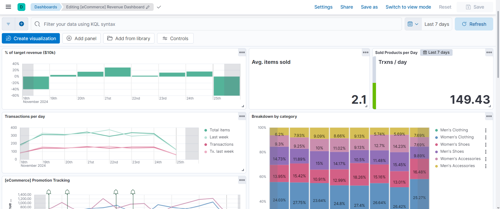
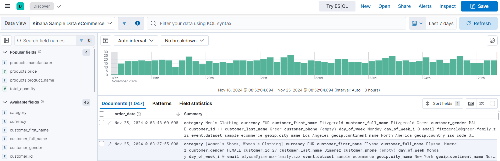

# [Kibana Notes](https://www.elastic.co/kibana)

Kibana is a user interface in a browser for visualizing and analyzing data from Elasticsearch data.
Kibana server communicates with Elasticsearch cluster.

## Visualizing Data

- Create interactive dashboards combining multiple visualizations
- Customizable layouts
- Using charts, graphs, heatmaps, histograms, maps

## Data Exploration
- Explore unfiltered data from indices by using Discover  

## Monitoring Data
- Searching and filtering logs to identify errors and patterns
- Visualizing metrics (resources like CPU, RAM, ...)
- Tracking transactions, performance

## [Search Analytics]((https://www.elastic.co/blog/what-your-elastic-app-search-analytics-are-telling-you))
- Click analytics in apps / webpages
- Query analytics
    - most frequent search terms and their results
    - top searches with no result

## Alerting
- Define real-time alerts for custom conditions sent via email and more
- Generate PDF / PNG / CSV reports of dashboards (scheduled)

## Machine Learning Integration
- Discover anomalies by using the built-in machine learning jobs
    - in transactions, logins, traffic
- Forecast future trends by analyzing past data
    - helps plan capacity and to anticipate warnings

## Security
- Role-based access control
    - restrict access to data, dashboards, visualizations per user
- Track user activities for security compliance

## Data Sources
- Elasticsearch only
- Logstash (part of the Elastic ELK stack) can import data to Elasticsearch

## Querying Languages
- Kibana Query Language
    - easy to learn
    - has limited functionality (summation, aggregation, ...)
- Lucene
    - harder to learn
    - has more functionality

## Comparison to [Grafana](https://logz.io/blog/grafana-vs-kibana/)

|Comparison point|Kibana|Grafana|
|-|-|-|
|Purpose|Monitoring resources (CPU, disk, memory, network usage), full-text querying with ELK stack |Monitoring logs, full-text querying
|Data Sources|Elasticsearch only|optimal for time-series data (e.g. InfluxDB), PostgreSQL, Elasticsearch and more using plugins|
|License|Closed-source beyond version 7.9|Free and open-source (FOSS/OSS)|
|Access Control|Access control is behind paywall|Has built-in user control|
|Querying|- Kibana Query Language (KQL) only filters   - Lucene is more powerful but is more complex to learn|Query Editor's syntax varies depending on the data source|
|Functionality|Many visualization options|More customization options, editing is easier (e.g. collapsible rows)|
|Alerting|Possible|Possible|
|Community|[Active open-source community](https://github.com/elastic/kibana/graphs/commit-activity)|[Active open-source community](https://github.com/grafana/grafana/graphs/commit-activity) as well|