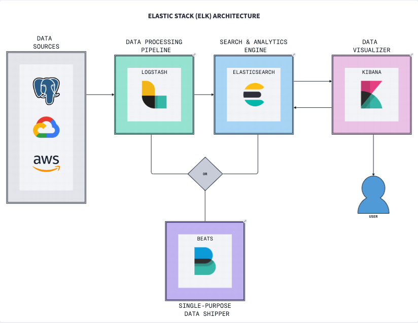
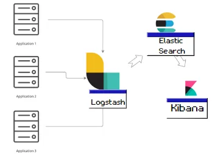
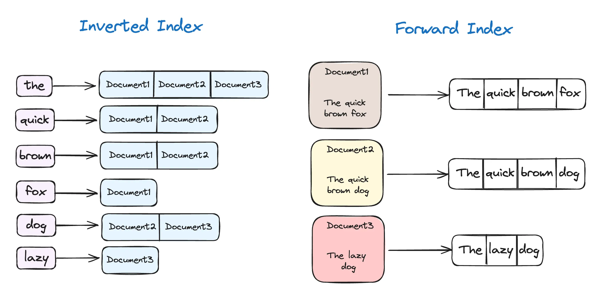
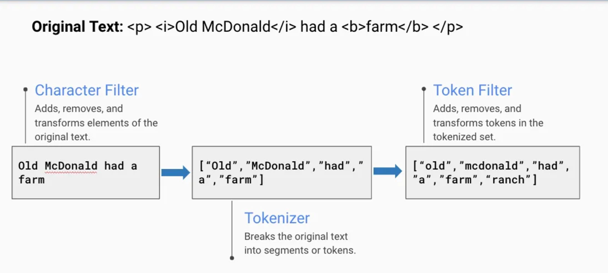
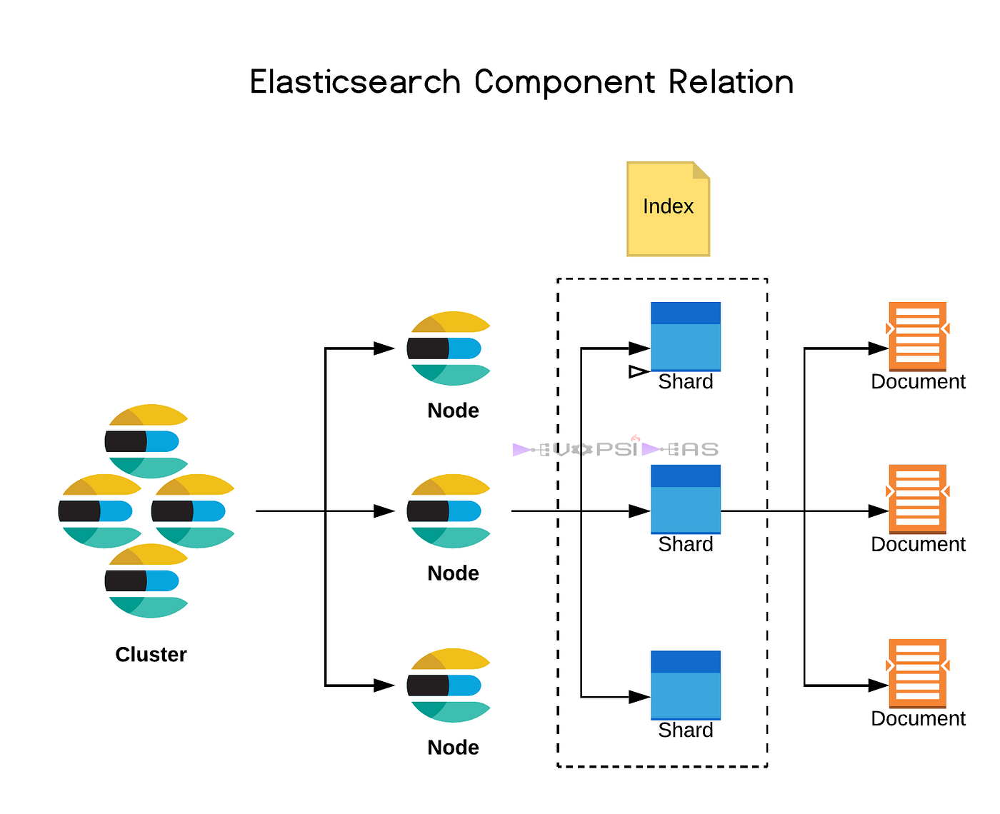
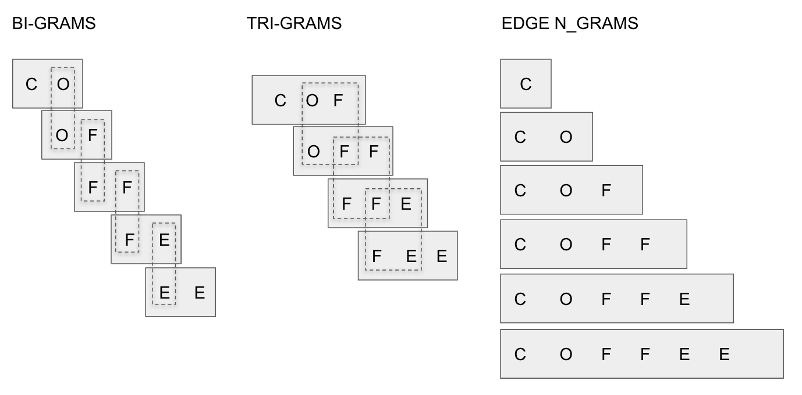

<!-- paginate: true -->


https://github.com/sebivenlo/esd-2024-elasticsearch

---


https://github.com/deviantony/docker-elk

```
docker compose up setup
```
```
docker compose up
```
---

# <!--fit-->Elasticsearch + Kibana
Matej Kopecky, Leonie Böger
ESD Fall 2024

---


- What is Elasticsearch + Elastic Stack
- History
- Use Cases
- Alternatives
- How does it work?
- Clients
- Core concepts
- Searching
- Performance optimization

## TODO: LEONIE CONTENT
- Kibana


---

# What is it?

Elasticsearch is an open-source search and analytics engine that allows for:
- Quick, scalable and efficient searching
- Full-text searching
- Analyzing large amounts of data
- Storing large amounts of data

---

# What is it?

- Built on Apache Lucene (search engine library written in Java!)
- Distributed/multitenant-capable
- Communciation using REST endpoint interface
- NoSQL (schema-less JSON documents)
- 8th most popular DB-engine
- Most popular search engine

---

# History

- First released in 2010 as Elasticsearch
- Gained popularity due to search speed, full-text search capability, ability to handle large amounts of data (petabytes) and ability to horizontally scale well.
- Rebranded to Elastic Stack in 2015 with the addition of Kibana, Logstash and Beats.

---



---

# Use cases

Elasticsearch is used for a wide and growing range of use cases. Here are a few examples:
- Application search
- Web search
- Enterprise search
- Logging and log/data analytics
    - Infrastructure metrics
    - Container monitoring
    - Geospartial data analysis and visualization (ex. Flights from - to)


---

# Use Cases
- Volkswagen - uses Elasticsearch for log storage and Kibana for visualization.
- Airbus - Near Real-Time access to aircraft technical documents (2 billion blocks of technical documents, 3 000 queries per minute). Results under 2 seconds.
- Microsoft - Azure environment monitoring with Elasticsearch for longs and Kibana for visualizations.
- GitHub - search feature. 2 billion documents. Analytics to reveal rogue users and software bugs by indexing all alerts, events, logs and tracking rate of specific code exceptions.

---
## Alternatives
<style scoped>
table {
  font-size: 17px;
}
</style>

| Feature | Elasticsearch | Splunk |
|:---:|:---:|:---:|
| Scalability | High scalability with horizontal scaling across nodes | Scalable but may require more resources for larger datasets |  |  |
| Real-Time Capabilities | Near-instantaneous search and analytics | Real-time processing but can be resource-intensive |  |  |
| Data Ingestion | Supports various methods (APIs, Logstash, Beats) | Robust ingestion with Universal and Heavy Forwarders |  |  |
| Query Language | Powerful Query DSL for complex searches | SPL for creating queries and visualizations easily |  |  |
| Search Capabilities | Advanced full-text search with complex queries | Comprehensive search with AI-driven analytics |  |  |
| User Interface | CLI-based with some graphical tools | Highly intuitive and user-friendly |  |  |
| Cost | Open-source with optional paid features | Proprietary with licensing costs based on data volume |  |  |
| Integration | Extensive integrations with various data sources | Wide range of third-party integrations |  |  |
| Use Cases | Log and event data analysis, full-text search, analytics | searching, monitoring, and analyzing machine-generated big data |  |  |

---

# Licensing changes - OpenSearch?


---

# Licensing changes - OpenSearch?

- Amazon offered its own "AWS Elasticsearch" Software as a Service product. (Elasticsearch was offering SaaS product as well)
- Elastic AV argued Amazon is taking advantage of Elasticsearch and not contributing enough to the open-source project.
- In 2021 Elasticsearch introduced new licensing. It includes restrictions on the use of the software by cloud providers (mainly Amazon).
- Amazon and some developers argued the new license is no longer truly open-source and forked the last version using the old license under the name "OpenSearch".
- In September 2024, Elastic NV stated its goals have been met and added AGPLv3 open source license as one of the options.


---

# Comparisons (to SQL)

| Elasticsearch | RDBMS      |
|---------------|------------|
| Cluster       | Database   |
| Index         | Table      |
| Document      | Column/row |

---

# How does it work?

Data can be inserted into Elasticsearch through:
- Elasticsearch document insert REST API (directly into Elasticsearch)
- Custom pipelines (Custom data transformation before indexing)
- Logstash
    - Provides input, filter, and output plugins for collecting, enriching, and transforming data from a variety of sources.
    - Large footprint.
- Beats
    - Lightweight data shippers that you install as agents on your servers to send specific types of operational data to Elasticsearch.
    - Small footprint.

---
# ELK Stack architecture


---

# How does it work?

Before data is saved to an Index, it is parsed, normalized and tokenized

- Tokenization - input is split into individual terms/tokens. By default divides text on word boundaries and removes most punctuation symbols.
    - "Hello ESD workshop!" -> "Hello", "ESD", "workshop"

- Normalization - input is converted to standard form. Lowercasing, removing punctuation, etc...
    - "Hello", "ESD", "workshop" -> "hello", "esd", "workshop"

Tokens from tokenization get saved into "inverted-index" (the magic thing making Elasticsearch so fast).

---

# Inverted Index


---

# Anatomy of Analyzer/Tokenizer


---

# Available clients
Using clients lets you use language native syntax to build queries instead of manually crafting HTTP request bodies and specifying endpoints.

- Java
- JavaScript
- Ruby
- Go
- .NET (C#)
- PHP
- Perl
- Python
- Eland
- Rust

---

# Java client example

```java
String searchText = "bike";

SearchResponse<Product> response = esClient.search(s -> s
    .index("products") 
    .query(q -> q      
        .match(t -> t   
            .field("name")  
            .query(searchText)
        )
    ),
    Product.class      
);

```

---

#  <!--fit-->Core concepts

---

# Document
- JSON object containing saved data for single object
- Stored in a specific index with unique ID
- Collection of fields — which, in turn, are key-value pairs that contain your data
- Structure defined by index mapping (specifies the data type for each field)


---

# Example of a document:

```json
{
  "title": "The Great Gatsby",
  "author": "F. Scott Fitzgerald",
  "publication_date": "1925-04-10",
  "isbn": "9780743273565",
  "genre": "Classic",
  "summary": "A novel about the American dream and the roaring twenties, centered around the mysterious Jay Gatsby..."
}
```

---

# Index

- Holds a collection of documents.
- Implicit index
    -  Dynamically mapped data types based on received data
    - Useful for quick start, but can be too basic for advanced use cases
- Explicit index
    - Manually configured fields BEFORE any data is saved in the index
    - Our choice for finer control
- Most commonly used data types:
    - Boolean, keywords, numbers, dates, text, ...

---

# Creating an index

```json
PUT /books
{
  "mappings": {
    "properties": {
      "title": { "type": "text" },
      "author": { "type": "text" },
      "publication_date": { "type": "date" },
      "isbn": { "type": "keyword" },
      "genre": { "type": "keyword" },
      "summary": { "type": "text" }
    }
  }
}
```

---

# Creating an index

- title: The title of the book, stored as a text field to allow for full-text search.
- author: The author of the book, also stored as a text field.
- publication_date: The date the book was published, stored as a date field.
- isbn: The International Standard Book Number, stored as a keyword field for exact matches.
- genre: The genre of the book, stored as a keyword field.
- summary: A brief summary of the book, stored as a text field to allow for full-text search.

---

# Deleting index

```json
DELETE /books
```

```json
{
  "acknowledged": true
}
```

---
# Inspecting index

```json
GET /books
```

```json
{
  "books": {
    "aliases": {},
    "mappings": {
      "properties": {
        "author": {
          "type": "text"
        },
        "genre": {
          "type": "keyword"
        },
        "isbn": {
          "type": "keyword"
        },
        "publication_date": {
          "type": "date"
        },
        "summary": {
          "type": "text"
        },
        "title": {
          "type": "text"
        }
      }
    },
    "settings": {
      "index": {
        "routing": {
          "allocation": {
            "include": {
              "_tier_preference": "data_content"
            }
          }
        },
        "number_of_shards": "1",
        "provided_name": "books",
        "creation_date": "1732301439820",
        "number_of_replicas": "1",
        "uuid": "-Q2MjnNoSeqOvJN6OyDMKw",
        "version": {
          "created": "8518000"
        }
      }
    }
  }
}
```

---

# Inserting a document

```json
POST /books/_doc
{
  "title": "Elasticsearch: The Definitive Guide",
  "author": "Clinton Gormley, Zachary Tong",
  "publication_date": "2015-02-07",
  "isbn": "978-1449358549",
  "genre": "Technology",
  "summary": "A comprehensive guide to Elasticsearch, covering everything from installation to advanced search techniques."
}
```

```json
{
  "_index": "books",
  "_id": "xqetZZMBgQCG7FfPBUqv",
  "_version": 1,
  "result": "created",
  "_shards": {
    "total": 2,
    "successful": 1,
    "failed": 0
  },
  "_seq_no": 0,
  "_primary_term": 1
}
```

---
# Nodes and clusters



---

# Node

An Elasticsearch node is a single instance of Elasticsearch running on a server. Each node stores data and participates in the cluster's indexing and search operations. Nodes can serve different roles: 
- Master nodes manage the cluster's state and coordinate even distribution and replication of data across nodes, ensuring cluster's health and performance
- Data nodes store the actual data and handle data-related operations
- Coordinating nodes distribute client requests to the appropriate data nodes

This division of roles helps in managing the workload efficiently and ensures the smooth functioning of the cluster.

---

# Cluster

An Elasticsearch cluster is a collection of nodes that work together to provide distributed search and analytics capabilties.
- Unique name
- Horizontal scaling (adding more nodes to the cluster)

This architecture allows:
- Handling large volume of data
- Provides fault tolerance through data replication
- Delivers high availability and efficient search performance

---

# <!--fit-->Search queries

---

# Match Query

Used to retrieve documents that match a specific field with a specific value.
```json
GET /_search
{
  "query": {
    "match": {
      "name": {
        "query": "Matej"
      }
    }
  }
}
```

---

# Range Query

Used to retrieve documents within a specific field's specific value range.

```json
GET /_search
{
  "query": {
    "range": {
      "age": {
        "gte": 15,
        "lte": 30
      }
    }
  }
}
```

gte - greater or equal
lte - less or equal

---

# Bool Query
Used to create complex logical queries by combining multiple queries.

```json
POST _search
{
  "query": {
    "bool" : {
      "must" : {
        "term" : { "user.id" : "kimchy" }
      },
      "filter": {
        "term" : { "tags" : "production" }
      },
      "must_not" : {
        "range" : {
          "age" : { "gte" : 10, "lte" : 20 }
        }
      },
      "should" : [
        { "term" : { "tags" : "env1" } },
        { "term" : { "tags" : "deployed" } }
      ],
      "minimum_should_match" : 1
    }
  }
}
```

---

# Match Phrase Query

Used for exact phrase matching. It retrieves documents that contain the complete searched phrase.
- All the terms must appear in the field
- They must have the same order as the input value
- There must not be any intervening terms, i.e. be consecutive (potentially excluding stop-words but this can be complicated)

---

# Match Phrase Query

```json
{ "foo":"I just said hello world" }

{ "foo":"Hello world" }

{ "foo":"World Hello" }

{ "foo":"Hello dear world" }
```
This match_phrase query will only return the first and second documents:

```json
{
  "query": {
    "match_phrase": {
      "foo": "Hello World"
    }
  }
}
```

---

# Ranking

Allows the organization of search results based on their importance to improve the quality of search outcomes.
Instead of asking "Is this document relevant?" Elasticsearch asks "How relevant is this document?"

---

# Ranking

- Relevance Ranking: Elasticsearch defaults to using a TF-IDF-based relevance ranking.
- Field-Based Ranking: This method allows ranking based on the value or score of a specific field.
- Time-Based Ranking: It is possible to rank documents based on a specific time interval or date.
- Custom Ranking: Elasticsearch enables users to create custom ranking strategies, allowing them to implement their own ranking logic.
- Spell Correction: Elasticsearch can automatically correct misspelt or incorrectly written words in queries. Elasticsearch can correct spelling errors by using “fuzzy” queries. Fuzz queries return words similar to a specific word, helping to correct spelling mistakes.
---

# Ranking

TF-IDF (Term Frequency — Inverse Document Frequency) is a statistical measure used to determine the mathematical importance of words within documents.

- Term Frequency: The number of times a term appears in a document. (Like CTRL + F / CMD + F)

- Inverse Document Frequency: looks across multiple documents within Elasticsearch and tells us that if a term appears too frequently, then there’s a higher probability it’s not as relevant.
For instance, if we refer to the index of a book, there are particular terms excluded. Terms like "the", “and,”, “of,” are not included within the index. Those terms appear so many times they lose relevance.

---

# Query optimizing

- Use Filters for Non-Scoring Queries: Filters are faster than queries because they do not calculate relevance scores. Use filters for static data or when scoring is not required.
- Caching: Utilize Elasticsearch's query cache and request cache to speed up repeated queries. Ensure that frequently accessed data is cached. (Indices can be assigned to hot or cold cache based on frequency/importancy of use)

---

# Index strategies

- N-grams/Edge N-grams:
    - Use n-grams for efficient partial matching.
    - Specific index fields need to be explicitly configured as N-grams.
    - N-grams break down text into smaller chunks, allowing for faster searches on partial terms. ("matej" into "m", "ma", "mat", "mate", "matej").
    This of course increases storage size of the index using N-grams, but is still fast to search as most of the compute intesive work is done while indexing.

---



---

- Keywords with Wildcards:
    - Use wildcard (*) for pattern matching within strings.
    - Specific index fields need to be explicitly configured as KEYWORD or WILDCARD type.
    - The difference from N-grams is that the wildcard pattern matching is done during runtime and is more compute intensive based on how large is the searched index, amount of wildcards used and their position in search query.

So basically these two example strategies make you consider and balance time and space complexity. It's up to the specific use case to decide, which strategy to choose.

---

# Kibana
- creating visualizations
- bar / pie charts, line graphs
- building dashboards

---

# performance optimization
- index strategies
- query optimizing
- hardware considerations (can leave that out)

# monitoring and maintenance
- monitoring tools
- Kibana
- APIs
- backup and restore
- scaling

# demo
- basic operations
- indexing a doc
- running query
- visualization with kabana

## assignment
- ??

---

# Sources
https://www.elastic.co/guide/en/elasticsearch/reference/current/elasticsearch-intro-what-is-es.html
https://www.elastic.co/customers/success-stories
https://www.youtube.com/playlist?list=PL_mJOmq4zsHbcdoeAwNWuhEWwDARMMBta
https://blog.avenuecode.com/elasticsearch
https://medium.com/@sweetcodeyrs/the-secret-sauce-in-elasticsearch-the-inverted-index-7994daf48184
https://towardsdev.com/elasticsearch-an-overview-of-structure-and-capabilities-45fe6cc0dd49
https://levelup.gitconnected.com/the-beginners-guide-to-search-relevance-with-elasticsearch-e7ee61f0695f
https://uptrace.dev/blog/elasticsearch-vs-splunk.html
https://medium.com/tech-explained/elasticsearch-explained-411e300413c7
https://medium.com/tech-explained/4-steps-to-setting-up-the-perfect-elasticsearch-test-environment-7d7ccf4bdeb9
https://medium.com/tech-explained/getting-hands-on-with-elasticsearch-9969a2894f8a
https://www.elastic.co/guide/en/elasticsearch/reference/current/query-dsl-range-query.html
https://stackoverflow.com/questions/26001002/elasticsearch-difference-between-term-match-phrase-and-query-string
https://www.elastic.co/guide/en/elasticsearch/reference/current/query-dsl-match-query.html
https://medium.com/@TechTim42/elastic-search-and-open-search-a-brief-history-of-the-license-war-8f474743e2ff
https://en.wikipedia.org/wiki/OpenSearch_(software)
https://www.elastic.co/customers/github
https://www.elastic.co/elasticon/conf/2018/sf/monitor-your-cloud-environment-with-the-logstash-azure-monitoring-module
https://www.elastic.co/customers/airbus
https://www.elastic.co/elasticon/tour/2017/munich/distributed-logging-and-monitoring-at-volkswagen-using-the-elastic-stack
https://www.elastic.co/demo-gallery/ent-search


---

